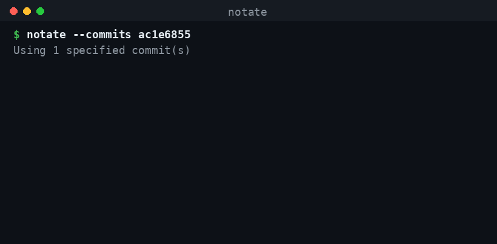

# notate

> Turn a git branch or merge commit into structured, junior-friendly technical documentation — auto-published to a Notion database.

**Status:** ✅ Used daily on a real monorepo. Zero third-party dependencies (Python stdlib only).

## Install

```bash
git clone https://github.com/mogamiGit/notate
cd notate
./install.sh        # symlinks `notate` into ~/.local/bin
```

Then create `~/.env.notate`:

```
ANTHROPIC_API_KEY=sk-ant-...
NOTION_API_KEY=secret_...
NOTION_DOCS_DATABASE_ID=your-database-id
```

## Why it exists

Documenting what a PR actually changed — for teammates, for onboarding juniors — is tedious and usually skipped. I wanted a single command that reads a git diff and writes a teaching-oriented doc straight into a team's Notion, explaining not just *what* changed but *why*, naming the patterns and concepts a junior should learn. No tool did this, so I built one.

## Example session



```
$ notate
🔍 Analyzing branch: feature/export-config
❌ Branch 'feature/export-config' has no commits of its own vs 'main'.
   Already merged (merge commit ac1e6855). Document it with:
     notate --commits ac1e6855

$ notate --commits ac1e6855
🔍 Using 1 specified commit(s)
   1 commit(s) found
   Repository:    my-monorepo
   Areas:         backend, frontend, tests
   Ticket:        NIXON-305
   PR:            https://github.com/org/my-monorepo/pull/226
   Reading modified files...
🤖 Analyzing commits with Claude... ⠹ 47s
✅ Analysis complete in 52s
📝 Creating Notion entry...

✅ Documentation created in Notion
   🔗 https://notion.so/...
```

It detected the branch was already merged, found the merge commit, and pointed at the exact command to run.

## What you get

A new Notion entry with: **Overview**, **Data flow** (text diagram of how the changed files connect), **Data contracts** (interfaces/types extracted literally from the diff), **Technical details**, **Error handling & edge cases**, **Technical decisions**, **Breaking changes**, **Usage examples**, **TODOs**, **Notes**, and a **Concepts & techniques** teaching section aimed at juniors.

Properties set on the entry: **Areas** (`backend`/`frontend`/`db`/`infra`/`tests`/`ci`/`docs`, derived from the changed paths), **Project** (repo), **Ticket** (parsed from the branch/merge message, e.g. `NIXON-305`), **PR** (clickable link to the pull request or commit), date, commit SHAs.

## How it works

```
git diff  ──▶  Claude (structured JSON)  ──▶  Notion blocks  ──▶  database entry
```

1. Resolves commits from a branch, range, or explicit SHAs (handles merge commits — `git show` won't emit a patch for a merge, so it diffs against the first parent).
2. Sends the diff + full content of the changed source files (generated/lock/vendored files are excluded) to Claude, with a prompt that forbids inventing code (only literal lines from the diff).
3. Converts the returned markdown into Notion blocks (tables, code, headings) and creates the page via the Notion API.

## Technical decisions

- **Zero third-party dependencies.** HTTP to Claude and Notion is done with `urllib`, git via `subprocess`. The tool installs and runs anywhere Python does — no virtualenv, no supply-chain surface, no `pip install` before first use. Trade-off: I write the request/response plumbing by hand instead of leaning on `requests`/`anthropic`.

- **Claude returns schema-enforced JSON, not prose.** The request uses the Claude API's structured outputs (`output_config.format` with a JSON schema), so the response is guaranteed valid JSON that maps deterministically onto Notion blocks (headings, tables, code) — no fragile string-cleaning, no "the model wrapped it in prose" failure class. The prompt also forbids inventing code (only lines that appear literally in the diff), which keeps the generated docs grounded instead of plausibly-wrong.

- **Merge commits are diffed against the first parent.** `git show <merge>` emits only a stat summary, no patch — a silent failure that produced empty docs. The tool detects multi-parent commits and switches to `git diff <sha>^1 <sha>`, recovering the full feature diff. This is the kind of edge case that only surfaces in real use.

- **Fail fast with actionable errors.** Every failure mode — not a git repo, sitting on `main`, an already-merged branch, a commit that isn't fetched locally — stops early and prints the exact next command to run, rather than a raw git error. The merged-branch path even auto-detects the merge commit and hands you the command.

- **Resilient UX around a blocking network call.** The Claude request can take a minute. A background thread renders a spinner with elapsed seconds; the call has a hard timeout and typed handling for network drops and Ctrl-C, so the tool never hangs silently or dumps a traceback.

- **Single file, on purpose.** At ~700 lines this is a script, not a framework. Splitting it into packages would add ceremony without buying anything. Pragmatism over architecture theater.

## CLI reference

| Goal | Command |
|---|---|
| Document the current branch | `notate` |
| Document another branch | `notate --branch other-branch` |
| A commit range | `notate --from abc1234 --to def5678` |
| Specific commits / a merge | `notate --commits abc1234` |
| Force the documentation type (steers the prompt) | `notate --type api` |
| Preview without writing to Notion | `notate --dry-run` |

Works only with **local** commits — run `git fetch` first if you copied a hash from GitHub.

## Use cases

`notate` is opt-in — it only runs when you run it, so there's no noise: you document what's worth documenting, nothing else. Which selector you use depends on *what* you want a page for.

- **Document an in-progress branch before merging it.** From your feature branch:
  ```bash
  notate
  ```
  Captures what the branch changed vs `main` — a per-PR tracking snapshot.

- **Document a PR that's already merged.** Point at its merge commit (notate detects this case and hands you the exact command):
  ```bash
  notate --commits <merge-sha>
  ```

- **Document a whole implementation that spans several PRs.** Instead of one fragmented page per PR, produce a *single* page covering the entire feature, by giving the commit range from where the work started to where it ended:
  ```bash
  notate --from <first-commit> --to <last-commit>
  ```
  Use this when the value is the implementation itself ("how was X built"), not the individual PRs.

- **Document a specific set of commits.** Cherry-pick exactly what to include:
  ```bash
  notate --commits abc1234 def5678
  ```

Group related pages in Notion by the **Ticket** property to see everything touched around the same piece of work across PRs.

## Configuration

| Variable | Purpose |
|---|---|
| `ANTHROPIC_API_KEY` | Claude API key |
| `NOTION_API_KEY` | Notion integration token (share the target database with the integration) |
| `NOTION_DOCS_DATABASE_ID` | Target database |
| `CLAUDE_MODEL` | Optional. Model to use (default `claude-sonnet-4-6`; must support structured outputs) |

### Notion database schema

The target must be a Notion **database** with these properties:

| Property | Type | Notes |
|---|---|---|
| `Name` | Title | Feature name (generated) |
| `Areas` | Multi-select | `backend`/`frontend`/`db`/`infra`/`tests`/`ci`/`docs`, derived from changed paths |
| `Ticket` | Select | Parsed from branch/merge message (e.g. `NIXON-305`); group related entries by it |
| `PR` | URL | Clickable link to the pull request (or commit) |
| `Project` | Text | Repository name |
| `Commits` | Text | Short SHAs (traceability detail) |
| `Date` | Date | |

Multi-select / select options are created on the fly by the Notion API. Share the database with your Notion integration so the token can write to it.

## Requirements

- Python 3.10+ (stdlib only — no `pip install`)
- `git`
- A Notion database shared with your integration

## Tests

Pure functions (markdown→Notion conversion, area/type detection, PR & ticket parsing, repo-slug parsing, prompt building, schema) are covered by a standard-library test suite — no dependencies to install:

```bash
python -m unittest discover tests
```

## Limitations

- Large diffs are truncated at 40k characters — very large PRs get partial coverage.
- The target must be a Notion **database** with the expected properties, not a plain page.
- Quality of the doc tracks the quality of the commit diff: if the diff is noisy, so is the output.

## License

MIT
